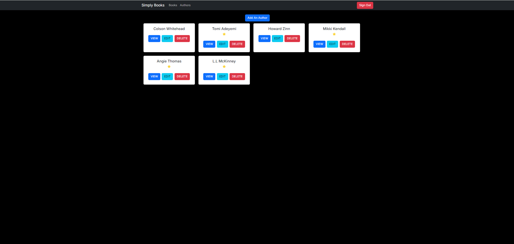
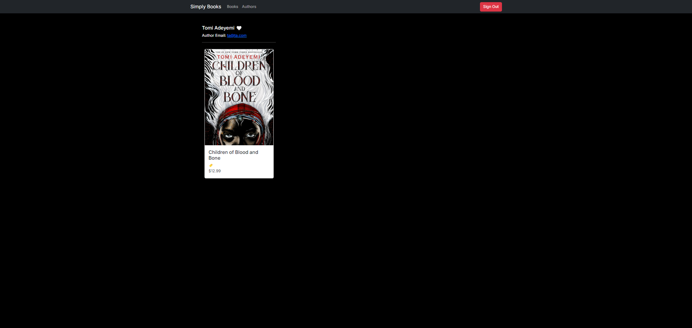

**`Simply Books - MJ`**

**`What's Simply Books?`**
The purpose of this site is to give a place for people to store, create, edit, and delete their favorite books and authors on a site where they can view it at any time.

**`Repository Link`**
https://github.com/MaxJones129/simply-books-official.git

**`Preoject Board Link`**
https://github.com/users/MaxJones129/projects/2

**`Features`**
-Login Function to Show Only your Account's Books and Authors
-Create, Read, Update, and Delete for Books and Authors
-A Working Author to Book Relationship, So When You Delete an Author, You Delete Their Books
-Pages Designed To View Details of Books and Authors. The Authors View Page also Shows Their Associated Books

**`Pictures of The Site`**

**`Contributors`**
-Max Jones

**`Loom Video Showing Off The App`**
https://www.loom.com/share/c1d6577692bb4033b991607e74b659a5?sid=4dedca01-c364-4e64-b1c2-a6c77fee4d90

**`Link To Site`**
https://simplybooksmj.netlify.app

**`Link To Postman`**
https://crimson-rocket-847800.postman.co/workspace/New-Team-Workspace~cbad8256-819f-4b9b-b91e-1ba2a390b19d/request/36583951-79d2a7ad-c95c-4aa7-8e98-5bd016fbe64e
